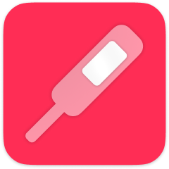

# iPhoneApp TapTemperature/体温登録 for "Health"

 

 

<!-- Manually sync below text between "🛠Menu.swift/📄About" and "AppStoreConnect/Description" and "/README.md(here)". -->

## 📄 Description

This application is designed to register body temperature data to the Apple "Health" application pre-installed on iPhone in the fastest possible way (as manual).

People frequently measure their body temperature (and basal body temperature) daily using a thermometer. Many iPhone users register their temperature data on "Health" app. The best solution is to use a smart thermometer that works with "Health" app and automatically stores measurements, but they are expensive and almost non-existent. Manual data registration is possible in "Health" app, but "Health" app is not designed for daily manual data registration. Therefore, manually entering data that occur continuously daily, such as temperature measurements, is a very time-consuming and stressful experience. This app was developed to solve such problems.

This app cannot read, view, or manage past data in "Health" app. This app is intended only to register data to the "Health" app. Please check the registered data on the "Health" app.

【Target/Use-case】

No "smart" thermometer.

Frequently measure my temperature (and basal body temperature) using a thermometer almost every day.

Intend to register the data into "Health" app every time, after measuring by a thermometer.

【OPTION】

With basal body temperature.

With second decimal places.

Auto complete function.

Unit: ℃, ℉

【OTHERS】

Launch "Health" app by one tap.

Local history for the purpose of "operation check" / "temporary backup".

Cancellation just after you registered a data.

Check source code in app.

All feature is completely free. Non ad. Non tracking.

## 🔗 AppStore link

[apps.apple.com/app/id1626760566](https://apps.apple.com/app/id1626760566)

## 🧰 Source code link

[github.com/FlipByBlink/TapTemperature](https://github.com/FlipByBlink/TapTemperature)

## ✉️ Contact

sear_pandora_0x@icloud.com

 

 

------

 

 

## Privacy Policy for AppStore

2022-05-31

### Japanese

このアプリ自身において、ユーザーの情報を一切収集しません。

### English

This application don't collect user infomation.

 

 

------

 

 

<!-- URL "Support page for AppStore" -->
<!-- https://flipbyblink.github.io/TapTemperature/ -->

<!-- URL "Privacy Policy for AppStore" -->
<!-- https://flipbyblink.github.io/TapTemperature/#privacy-policy-for-appstore -->
