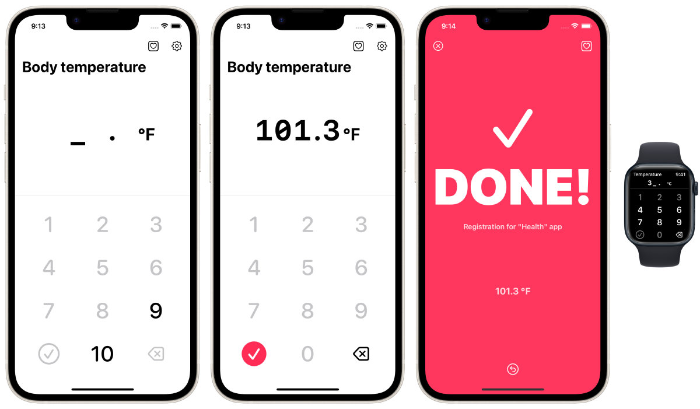

TapTemperature for "Health" - iPhone, Apple Watch
=================================================
_Register your weight data to the "Health" App as fast as possible!_

Description
------------
This application is designed to register body temperature data to the Apple "Health" application pre-installed on iPhone in the fastest possible way (as manual).

### Target / Use-case
No "smart" thermometer.

Frequently measure my temperature (and basal body temperature) using a thermometer almost every day.

Intend to register the data into "Health" app every time, after measuring by a thermometer.

### Option
Mode as basal body temperature.

Mode for second decimal places.

Auto complete function.

Unit: ℃, ℉

Option to hide AD banner. (In-App Purchase)

### Others
Apple Watch support.

Launch "Health" app by one tap.

Cancellation by one tap just after you registered a data.

Check source code in app.

All feature is free.

### Concept
People frequently measure their body temperature (and basal body temperature) daily using a thermometer. Many iPhone users register their temperature data on "Health" app. The best solution is to use a smart thermometer that works with "Health" app and automatically stores measurements, but they are expensive and almost non-existent. Manual data registration is possible in "Health" app, but "Health" app is not designed for daily manual data registration. Therefore, manually entering data that occur continuously daily, such as temperature measurements, is a very time-consuming and stressful experience. This app was developed to solve such problems.

This app cannot read, view, or manage past data in "Health" app. This app is intended only to register data to the "Health" app. Please check the registered data on the "Health" app.

Source code link
-----------------
[github.com/FlipByBlink/TapTemperature](https://github.com/FlipByBlink/TapTemperature)

### Source code (Mirror) link

[gitlab.com/FlipByBlink/TapTemperature_Mirror](https://gitlab.com/FlipByBlink/TapTemperature_Mirror)

Contact
--------
sear_pandora_0x@icloud.com

AppStore link
--------------
[apps.apple.com/app/id1626760566](https://apps.apple.com/app/id1626760566)

<!-- URL "Support page for AppStore" -->
<!-- https://flipbyblink.github.io/TapTemperature/ -->
<!-- URL "Privacy Policy for AppStore" -->
<!-- https://flipbyblink.github.io/TapTemperature/#privacy-policy-for-appstore -->

* * *

 
 

Privacy Policy for AppStore
----------------------------
2022-05-31

### Japanese
このアプリ自身において、ユーザーの情報を一切収集しません。

### English
This application don't collect user infomation.

 
 
